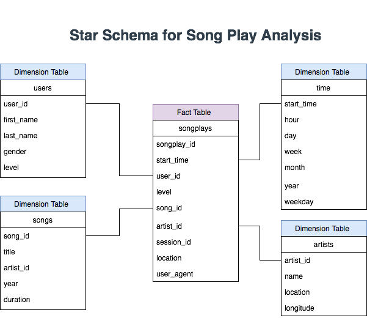

# Data Modeling with Postgres

## Introduction 
This project aims to create a database schema and ETL pipeline for the Sparkify streaming app, where songs and user activity are collected, with interest in understanding which songs users listen to the most in the app.  

## DataSets   
Sparkify collected their app data in two directories in a JSON format:

1- Song Dataset: 
    - Folder name:song_data 
    - a subset of real data from the Million Song Dataset 
    - contains the metadata on the song on the app and the artist of the song 

2- Log Dataset:
    - Folder name:log_data 
    - generated by event simulator based on the songs in the Million Song Dataset 
    - contains the logs on user activity in any given day   

## The Star Schema
The following tables are optimized to query and retrieve data for the song play analysis. 
- FactTable
    - songplays 
- DimensionTables
    - users
    - songs
    - artists
    - time
    

## Python Scripts
we have three python files that should be run sequentially:

1- "sql_queries.py", contains the DROP, CRETE, INSERT, SELECT statements, or SQL queries, and it is referenced in "create_tables.py" AND "etl.py" files.

2- "create_tables.py", contains the functions that create and connect to the Sparkify DB and calls the queries or the statements in the "sql_queries.py" file. Also, it handles any error that might occur when running all of its functions using the try and except statements.    
    
3- "etl.py", contains the extraction and the insertion of data from the JASON files for each data set to the newly created tables by processing a single file of each table and loading one record into its corresponding table, then finally processing all of the files in both directories. 

As a result, create_tables.py must be run first, then etl.py could be run after for the ETL pipeline for the data insertion.  